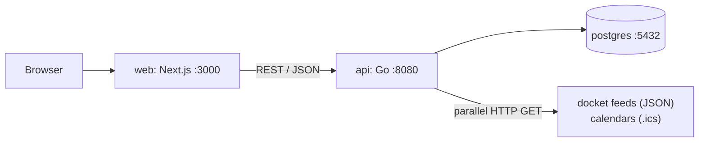

# DocketIQ

A deadline tracker for legal matters. It ranks what is due by urgency, flags deadlines that
land too close together, and keeps itself current by polling court docket feeds and calendar
exports in parallel.

## Architecture



One Go binary serves the REST API and runs the poller. PostgreSQL stores cases and deadlines.
Next.js renders the UI. The browser only talks to Next.js: server components and server actions
call the Go API over the Compose network, so there is no CORS setup and no API address in client
JavaScript. The API port is published anyway so you can try it with curl.

## How polling works

Eight sources are configured across seven distinct URLs. Every poll fetches them concurrently,
with at most `POLL_CONCURRENCY` HTTP requests in flight at once (five by default).

Two cases in the same court watch the same shared hearing calendar. That is the reason there is
both a singleflight group and a TTL cache, because they cover different kinds of overlap:

- **singleflight** merges calls that are in flight at the same moment. When both Arden sources
  reach the same URL in one poll, one request goes out and the second caller attaches to it. The
  run summary reports that source as `shared`.
- **the TTL cache** covers calls that arrive later. A second poll inside `CACHE_TTL` makes no
  requests at all and reports every source as `cache`.

The semaphore sits inside the singleflight function, after a second cache check. That way the
bound applies to real HTTP requests: a cache hit or a follower never waits for a slot behind a
slow feed.

Each source gets the shared items copied into its own rows, filtered by an optional `match`
substring, and stamped with its own case id and external id. That is what lets one fetch land in
two different cases. Errors belong to their source, are never cached, and do not affect the
others, so one broken feed costs you that feed and nothing more.

### Measured

The demo feeds answer with a fixed latency between 250 and 450 ms, adding up to 2440 ms if you
fetch them one at a time. Five runs at each setting, taking the median of the startup poll:

| `POLL_CONCURRENCY` | Median | Range |
|---|---|---|
| 5 | **762 ms** | 666 to 777 ms |
| 1 | **2469 ms** | 2465 to 2477 ms |

Measured on an Apple M3 running macOS 26.1, Go 1.27.1, with Postgres in Colima. The sequential
number is the sum of the feed latencies plus about 30 ms of overhead. At five it takes two rounds
instead of seven, which is where the 3.2x comes from.

## Ranking and conflicts

Urgency is `1 / (max(days_until_due, 0) + 1)`. Due today scores 1.0, tomorrow 0.5, a week out
0.125. The clamp matters: without it the formula divides by zero one day after the due date and
goes negative after that. Clamping at zero makes an overdue deadline score the same as one due
today, and the tie-break on due date then puts the oldest one first.

Conflicts come out of a single forward sweep. After sorting by due date, I walk forward from each
deadline until the first one out of range, which is either a different calendar day or further
than the requested window. Stopping at the immediate neighbour instead would miss the first and
third when three deadlines share a day. The cost is O(n log n + k) for k reported pairs.

Every day boundary is computed in `APP_TIMEZONE`, never in UTC and never in the container's local
zone. Day counts are calendar days: I take each instant's local date, rebuild both as UTC
midnights and subtract. Using `due.Sub(now) / 24h` instead would be wrong across a daylight saving
change, and at 11pm it would call 1am tomorrow zero days away.

## Running it

```bash
docker compose up --build
```

- Dashboard: <http://localhost:3000>
- API: <http://localhost:8080/api/deadlines?sort=urgency>
- Postgres: `127.0.0.1:5433`

Postgres publishes 5433 rather than 5432, because a local Postgres on the usual port silently
shadows the container and you get `role "docketiq" does not exist` instead of an error that
explains itself.

There is no `.env` file to create. Compose supplies every default, and `.env.example` documents
them.

To start over, which you need after changing `db/schema.sql` or `db/seed.sql`, since Postgres only
runs its init scripts against an empty volume:

```bash
docker compose down -v
```

### Adding a real source

Any URL that returns the docket JSON shape or an `.ics` file works. Add an entry to
`api/sources.json` with a unique `id`, a `kind` of `docket` or `calendar`, the `url`, and the
`case_id` it belongs to. An optional `match` keeps only the entries whose title contains that
substring, which is how two cases share one court calendar.

The demo entries point at `http://localhost:8080/mock/...`, which is the API serving its own mock
feeds. That is deliberate, so the poller still does real HTTP over the network stack, but it means
changing `API_ADDR` means changing those URLs too.

## API

| Method | Path | Purpose |
|---|---|---|
| GET | `/api/cases` | List cases with deadline counts |
| POST | `/api/cases` | Create a case, optionally with deadlines |
| DELETE | `/api/cases/{id}` | Delete a case and its deadlines |
| POST | `/api/cases/{id}/deadlines` | Add a manual deadline to a case |
| GET | `/api/deadlines?sort=urgency\|due` | Ranked deadlines |
| GET | `/api/deadlines/conflicts[?window=36h]` | Conflicting pairs |
| PATCH | `/api/deadlines/{id}` | Edit a manual deadline |
| DELETE | `/api/deadlines/{id}` | Delete a manual deadline |
| POST | `/api/poll` | Poll all sources now |
| GET | `/healthz` | Liveness plus a database ping |

Deadlines that came from a feed belong to their source. Editing or deleting one answers 409,
because the next poll would undo the change.

## Tests

```bash
cd api && go test -race ./...
cd api && go test -race -tags=integration ./...   # needs Docker, uses testcontainers
cd web && npm run lint && npm run typecheck && npm test && npm run build
```

The Go tests cover the ranking arithmetic, the poller's concurrency bound and dedup behaviour,
the feed parsers and every handler. The poller tests run under `-race` with `goleak`, and they
force the shared-URL overlap deterministically rather than relying on timing. The integration
tests apply the real `db/schema.sql` to a throwaway Postgres.

If you run Docker through Colima, testcontainers needs pointing at its socket:

```bash
DOCKER_HOST="unix://$HOME/.colima/default/docker.sock" \
  TESTCONTAINERS_DOCKER_SOCKET_OVERRIDE=/var/run/docker.sock \
  go test -race -tags=integration ./...
```

## Screenshots


## Trade-offs and what I would do next

There is no auth and no concept of a user. Conflicts are checked across every case, which is
right for one person and wrong the moment there are two.

A deadline that disappears from a feed stays in the database. Polling only ever inserts or
updates, so a withdrawn hearing needs deleting by hand. Reconciling would mean tracking which
external ids a source returned last time.

`RRULE` is ignored, so a recurring calendar event counts once, at its first occurrence. Real court
calendars do use recurrence for status conferences.

The cache lives in one process. Running several API replicas would give each its own cache and
each its own poll ticker, so they would all fetch the same feeds. A shared cache, or a Postgres
advisory lock around the sync, would be the fix.
